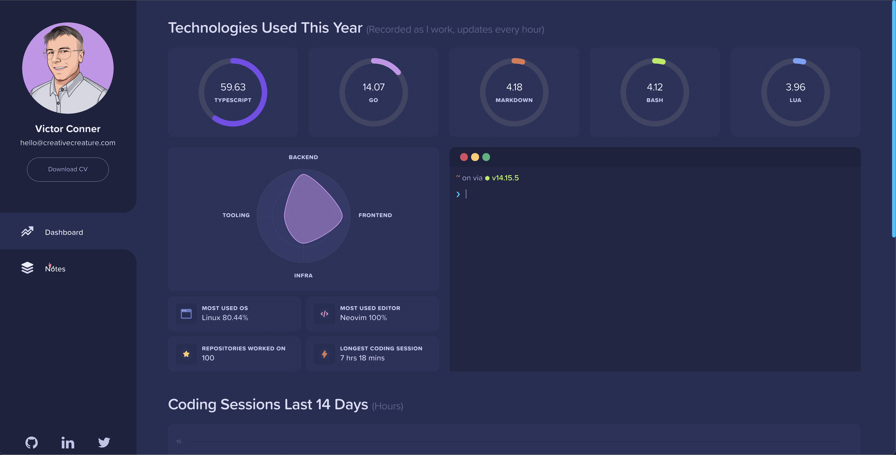
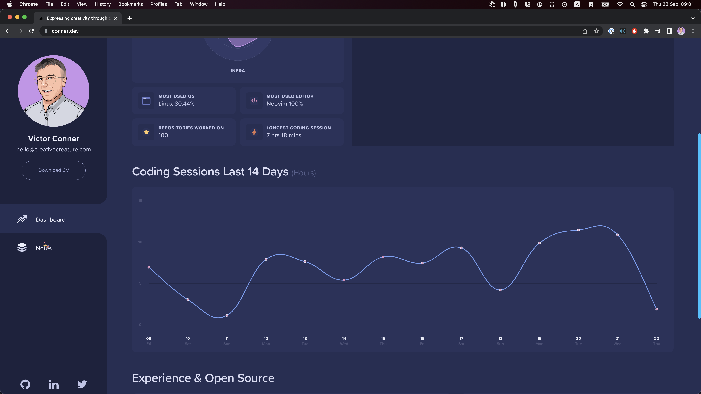

# Code harvest
Harvesting metadata from your coding sessions.

## Background
I've enjoyed building custom charts ever since I started to code. I also think
it's fun to get some data-driven insights about the work I do.

Therefore, I've created this project to generate some statistics about my
coding sessions.

The sessions are aggregated on a daily basis, and some of the information can be
viewed on my [website](https://conner.dev)

## Overview
I was heavily inspired by how language servers use remote procedure calls to
communicate. The latency is low, and it would make it easy to add plugins for
multiple editors in the future.

I run the RPC server as a daemon. I've created a small [plugin](https://github.com/creativecreature/vim-code-harvest) for neovim that
maps different autocommands to remote procedure calls to the server.

The server writes each session to a mongodb database. You can provide a URI in
the `.envrc` file.

## Building
The `Makefile` has a **build** target for compiling both the server and client.
To get more information about the available targets run `make help`.

## Running your own version
Start by building the binaries. The server should run as a daemon. Depending on
your OS I suggest that you use either `systemd` or `launchd`. Windows has a
multitude of alternatives too, but I've never used them.

If you use neovim you can use the plugin I created. Just make sure the binaries
are in your `$PATH`.

You are also going to need a mongodb database. To start with I would suggest
going to the official mongodb website, and installing the community edition on
your own machine.

If you don't want to use mongodb you could easily change the `saveSession`
function to write them to disk or post them to some API.
